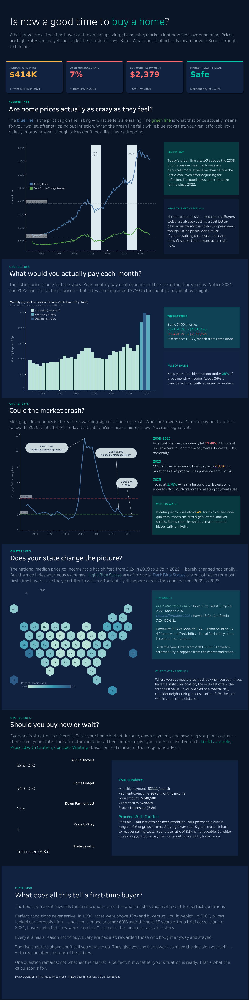

# 🏡 House Buyer: Homebuying Affordability & Market Risk Dashboard

> **An interactive Tableau dashboard that helps prospective homebuyers evaluate affordability, mortgage risk, and housing market conditions using real U.S. economic data.**

---

## 📖 Overview

Buying a home involves more than comparing prices. Mortgage payments, debt, income, interest rates, and housing market trends all influence whether a purchase is financially sustainable.

This project combines multiple economic datasets into an interactive Tableau dashboard that transforms complex financial metrics into clear, easy-to-understand insights.

Users receive a simple recommendation based on their financial situation:

🟢 **Looks Favorable**

🟡 **Proceed with Caution**

🔴 **Consider Waiting**

---

## ✨ Features

* 📊 Interactive Tableau dashboard
* 🏠 Home affordability calculator
* 💰 Debt-to-Income (DTI) analysis
* 📈 Price-to-Income ratio analysis
* 📉 Mortgage payment estimation
* 📍 Housing market trend visualization
* ⚠️ Risk assessment based on financial indicators
* 🎛️ Dynamic parameters and filters

---

## 🛠 Tech Stack

| Category        | Tools           |
| --------------- | --------------- |
| Visualization   | Tableau         |
| Data Analysis   | Python, Pandas  |
| Data Sources    | FRED, FHFA, BLS |
| Version Control | Git, GitHub     |

---

## 📂 Project Structure

```text
house-buyer-dashboard/
│
├── house-buyer-dashboard.twbx
├── README.md
└── dashboard-preview.png
```

---

## 📸 Dashboard Preview




---

## 🎯 Problem Statement

Many first-time homebuyers struggle to understand whether purchasing a home is financially realistic.

Traditional mortgage calculators only estimate monthly payments and often ignore important financial indicators such as debt burden, income, housing affordability, and broader market conditions.

This dashboard combines those factors into one interactive decision-support tool.

---

## 📊 Data Sources

* Federal Reserve Economic Data (FRED)
* Federal Housing Finance Agency (FHFA)
* Bureau of Labor Statistics (BLS)

---

## 🚀 Future Improvements

* Add regional housing market comparisons
* Include real-time mortgage interest rates
* Integrate demographic and census data
* Build a web-based version using React and Python
* Add machine learning predictions for housing affordability

---

## 💡 What I Learned

Through this project, I gained experience with:

* Designing interactive Tableau dashboards
* Cleaning and transforming real-world datasets
* Building parameter-driven visualizations
* Communicating financial insights through data storytelling
* Applying economic indicators to practical decision-making

---

## 👩‍💻 Author

**Ei Kay Khaing Myo**

Computer Science student at **Baruch College**
Concentration: Financial Mathematics

🔗 LinkedIn: *https://www.linkedin.com/in/ei-kay-khaing-myo/*

---

⭐ If you found this project interesting, feel free to star the repository.
